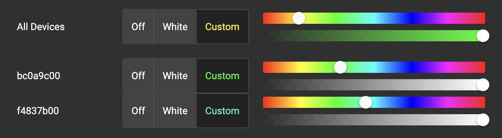
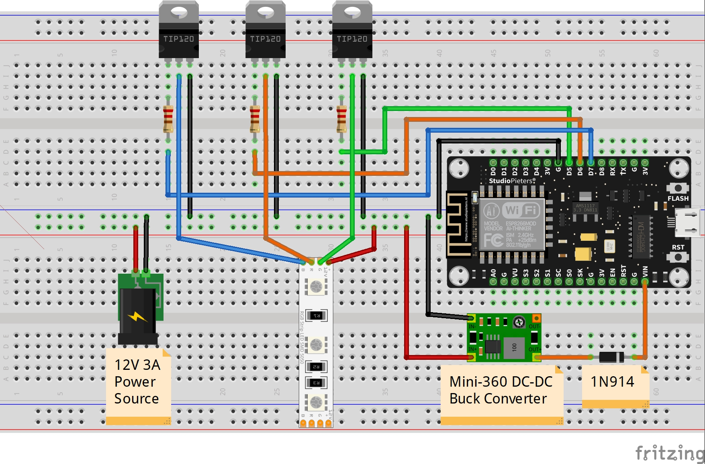

# Smart light control system in home WiFi network

## Update 1/8/2023

I've decided to continue deloping this project with some redesign:
- I'm going to use Kubernetis installed on my Raspberi Pi server. All backend services, MQTT queue server, database storages will be in Kubernetis with some deployment automation from my working machine
- I plan to extend the fulctionality so it supports other types of devices except just lings (motion detectors, cameras). I also want to introduce grouping of devices with ability co control the group from UI. In future I want to add sripting support so devices can sent commands to each other while I can program this logic on UI
- I want to extend UI to supprt everything above
- All of this will require more infrastructure: database to keep configs and states (Cassandra or Postgress), cache to keep agent status realtime information (Redis), reverse proxy server
- I want to split the backend web service into several: ping service to accept ping messages from devices, command seervice to send commands to devices controlled by UI, confige servers to provide groups and device configurations to devices, maybe something else
- I've decided to rewrite the backend from Python to Kotlin. Python will remain the programming language for devices

### Goals
* Design devices (hardware and firmware) that can be controlled over a web application in a home WiFi network
* Each device based on ESP8266 WiFi module
* Raspberry Pi 4 server to control devices and to host a web client

### Project structure

* ESP8266 firmware in MicroPython for devices
* SMD5050 RGB LED Strip Lights as controlled devices
* Website in Angular 12 server by Python/Flask webserver hosted on Raspberry Pi server to control devices
* SQL Lite database on Raspberry Pi to remember device user settings
* Mosquitto messaging queue for MQTT communication between  
* Electrical circuits and diagrams of devices
* Guidance of how to setup this all

This is how the web interface looks like for now:


# Setup

### Raspberry Pi

Raspberry hosts Mosquitto MQTT message broker and Python webserver. There for need to install Mosquitto, update Python up to 3.9 version and install Python libraries.
1. Connect Raspberry Pi to home WiFi and update it:
   
    ```bash
    sudo apt update
    sudo apt full-upgrade
    ```

2. Install Mosquitto ([link](https://mosquitto.org/download/))
        
    ```bash
    sudo apt install mosquitto mosquitto-clients
    sudo systemctl status mosquitto
    ```

    This command will return the status of the “mosquitto” service. You should see the text “active (running)” if the service has started up properly.

    For testing purposes you can run a Mosquitto client and listen for messages in the topic we are going to use:
    
    ```bash
    mosquitto_sub -h <raspberry_ip> -t "home/ping"
    # where <raspberry_ip> is the IP address of Raspberry or 'localhost'
    ```
   
    All devices will send an information about their status here every 15 seconds.
    To send a message to the topic from a terminal use the command:
   
    ```bash
    mosquitto_pub -h <raspberry_ip> -t "home/ping" -m '{"mac": "00:00:00:00:00:00", "id": "ab0c9d00", "rgb": [0, 1023, 61]}'
    ```

3. Install Python libraries

   ```bash
   # create virtual environment (this is optional)
   python3 -m venv ~/path/to/venv
   source ~/path/to/venv/bic/activate
   # install Python libraries
   pip3 install flask flask_cors mqtt_client
   ```

4. Upgrade node.js and npm

   ```bash
   sudo apt remove nodejs
   curl -sL https://deb.nodesource.com/setup_16.x | sudo -E bash -
   sudo apt install nodejs
   # check versions of node and npm
   node -v
   npm -v
   ```

5. Checkout project on Raspberry Pi to build and run webserver
     
   ```bash
   # create some directory and navigate into it, clone the project
   git clone git@github.com:hiper2d/smart-home-light-automation-in-python.git

   # navigate to the angular directory
   cd /path/to/project/smart-home-light-automation-in-python/angular
   
   # install frontend libraries and build frontend
   npm install
   npm run build
   
   # navigate to the respberrypi directory with Python/Flask webserver scrips
   cd /path/to/project/smart-home-light-automation-in-python/raspberrypi
   
   # Add Raspberry Pi IP address to mqtt_client.py file
   hostname -I
   nano mqtt_client.py
   # replace <raspberry_ip> with the real IP
   
   # start webserver on port 5000
   python3 website.py
   ```
    
Open the address [http://<raspberry_ip>:5000/](http://<raspberry_ip>:5000/). You should see a webpage with no devices except the 'All Devices' control.

Simulate a new device ping message, so the webserver can pick it up:

```bash
mosquitto_pub -h <raspberry_ip> -t "home/ping" -m '{"mac": "0", "id": "abc", "rgb": [0, 1023, 61]}'
 ```
New device should appear on the webpage. If it doesn't send ping messages regularly, the webserver will consider it as inactive in 60 seconds and remove from the webpage.

While the device is on the webpage, you can control it. To monitor messages from the frontend to devices you can subscribe to the device topic:

```bash
mosquitto_sub -h <raspberry_ip> -t "home/abc"
 ```

### ESP8266

1. Use the [official guide](https://docs.micropython.org/en/v1.14/esp8266/tutorial/intro.html) of installing MicroPython to a ESP8266. Finding a serial port may be tricky. Before connecting the ESP8266 to Raspberry Pi run the following:

   ```bash
   ls -l /dev/ttyUSB*
   ```
   
2. Edit MicroPython scripts in the `esp8266` project's directory:
   - *boot.py*: update `ssid` and `password` with your local home WiFi network name and password
   - *main.py* update `mqtt_server` with your Raspberry Pi IP address in the home network
   
3. Copy all 4 files from the `esp8266` project's directory

# Circuit diagram



### List of components

1. 1 x ESP8266 NodeMCU development board
2. 1 x SMD 5050 RGB LED strip - 1
3. 3 x TIP120 NPN transistor
4. 3 x 180-240 Ohm resistor
5. 1 x Mini-360 DC-DC buck converter
6. 1 x 1N914 switching diode
7. 1 x 12V 3A power supply

# How this all Works

Diagram with no text explanation for now about the device register process:


