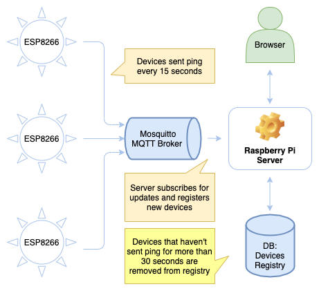

# Smart light control system in home WiFi network

The goal of this project:
* Design devices (hardware and firmware) that can be controlled over a web application in a home WiFi network
* Each device based on ESP8266 WiFi module
* Raspberry Pi 4 server to control devices and to host a web client

This project consists of the following:
* ESP8266 firmware in MicroPython for devices
* SMD5050 RGB LED Strip Lights as controlled devices
* Website in Angular 12 server by Python/Flask webserver hosted on Raspberry Pi server to control devices
* SQL Lite database on Raspberry Pi to remember device user settings
* Mosquitto messaging queue for MQTT communication between  
* Electrical circuits and diagrams of devices
* Guidance of how to setup this all

This README is empty for now because the project has just been started.

Diagram with no text explanation for now about the device register process:
